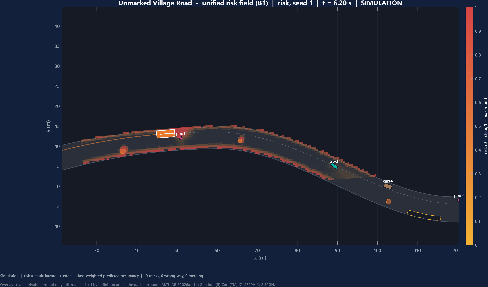
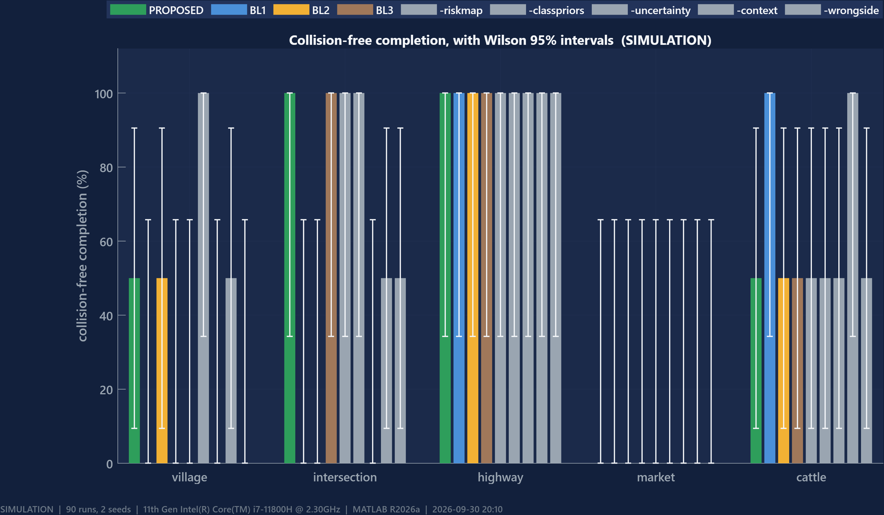
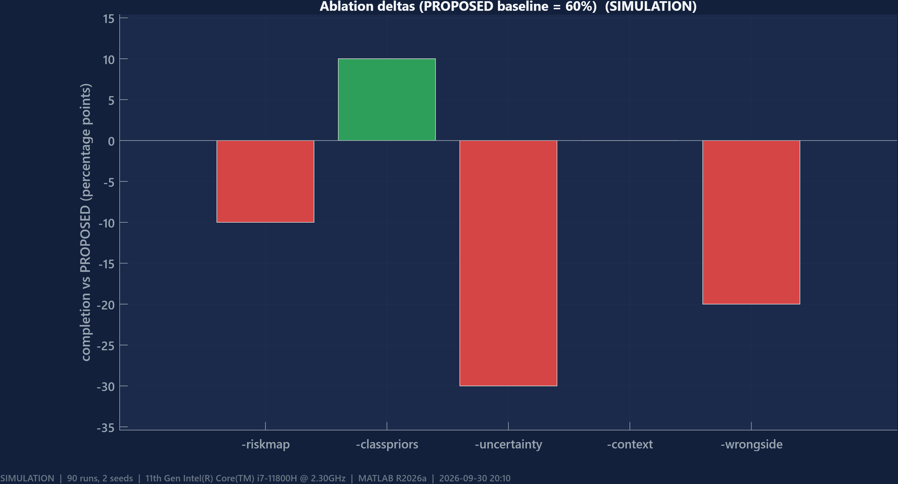
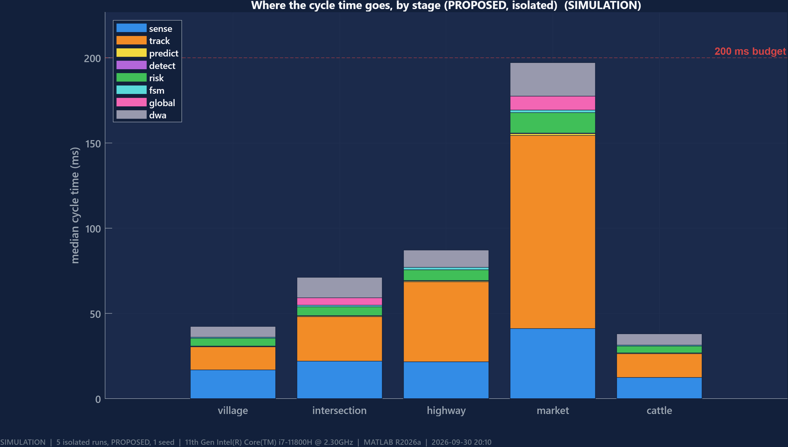
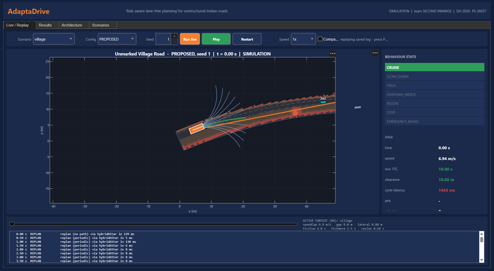
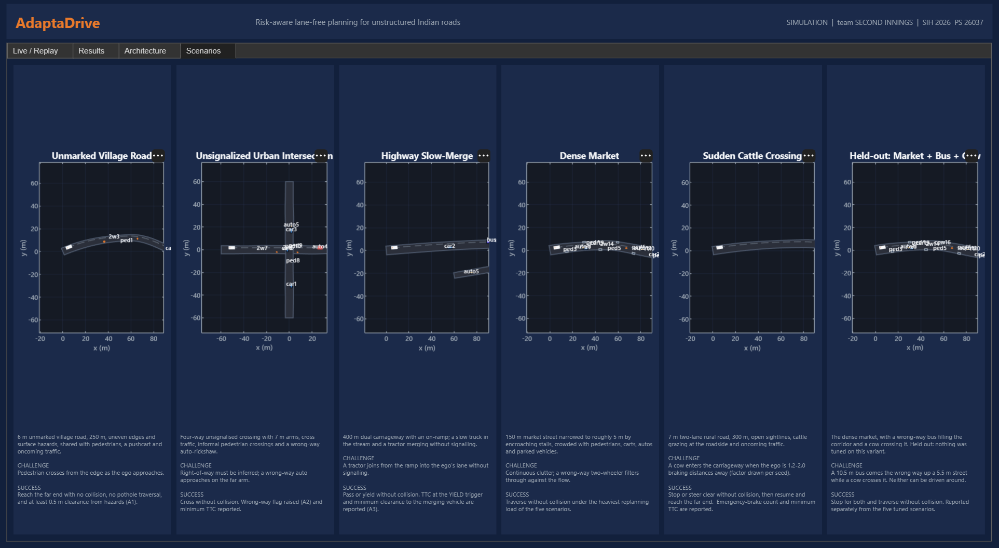

# AdaptaDrive

**Risk-aware, lane-free path planning and collision avoidance for unstructured Indian roads.**

Team **SECOND INNINGS** · SIH 2026 · Problem Statement **26037** (MathWorks, Smart Vehicles)




*The core idea in one picture. No lane markings, no HD map — just a continuously
shaded map of how dangerous each patch of ground is right now. Dark red is
impassable, dark grey surround is off-road. The vehicle plans through the gaps.*

> **Everything in this repository is a simulation.** No number here was measured
> on a road. Architectural coverage is not validated performance — the team
> research document says so in §35.1, and this project is built to keep that
> distinction visible rather than blur it.

---

## The idea

Conventional autonomy asks *"which lane am I in?"*. On an unmarked Indian road
that question has no answer, and a system built on it has nothing to fall back
on.

AdaptaDrive asks a different question, ten times a second:

> **For every patch of ground around me, how dangerous is it to be there?**

It then drives through the low-danger ground. There are no lanes in that
representation — only a continuous **risk field** built from static hazards,
tracked road users, their *predicted* future positions, and how *uncertain* each
of those predictions is.

**The closed loop**, with nothing scripted:

```
Perceive → Track/Fuse → Predict → Risk → Decide → Plan → Control → Vehicle ─┐
    ▲                                                                       │
    └───────────────────────────────────────────────────────────────────────┘
```

The vehicle is never told where to go. It sees only what its sensors report, and
if perception is wrong it genuinely crashes.

| Capability | Requirement |
|---|---|
| Lane-free planning over a continuous risk field — no lane graph, no HD map | B1 |
| Heterogeneous agents: car, bus, auto-rickshaw, two-wheeler, pedestrian, pushcart, cow | B3 |
| Road hazards (potholes, broken edges) as graded planning inputs, not walls | A1 |
| Wrong-way detection as a named subsystem | A2 |
| Informal-merge detection (no indicators, no signals) | A3 |
| Uncertainty-shaped risk — covariance grows with prediction horizon | B2 |
| Context-adaptive parameters per road type | B4 |
| Baselines, ablations and stress conditions | B5 |

---

## Results at a glance

90-run matrix: 9 configurations × 5 scenarios × 2 seeds. Zero errors, zero stalls.



| Scenario | PROPOSED | BL1 lane-follow | BL2 reactive | BL3 static-world |
|---|---|---|---|---|
| Village | **50%** | 0% | 50% | 0% |
| Intersection | **100%** | 0% | 0% | **100%** |
| Highway | 100% | 100% | 100% | 100% |
| Market | 0% | 0% | 0% | 0% |
| Cattle | 50% | **100%** | 50% | 50% |
| **Overall** | **60%** | 40% | 40% | 50% |

**PROPOSED beats all three baselines** and is the only configuration that
completes both village and intersection.

Two seeds per cell means Wilson 95% intervals span roughly **9–91%**, so *none of
these comparisons is statistically significant*. The table describes what
happened; it does not prove anything. Ten seeds per cell is what a claim would
need, and this machine could not run it in the time available.

### Which components actually earn their keep



| Remove this | Overall | Change |
|---|---|---|
| — (PROPOSED) | 60% | — |
| Uncertainty handling (B2) | **30%** | **−30** |
| Wrong-side preference | 40% | −20 |
| Graded risk map (B1) | 50% | −10 |
| Context adaptation (B4) | 60% | 0 |
| Class priors (B3) | **70%** | **+10** |

**Uncertainty is the most valuable component in the system** — remove it and
completion halves.

**Class priors make things worse.** Removing them *improves* completion by 10
points overall and by 50 points on village (100% vs 50%). The likely mechanism:
per-class risk weighting inflates the footprint of pedestrians and carts, so on a
6 m road the planner treats a passable gap as impassable. This is evidence
against a design decision this project argued for, and it is reported rather than
dropped.

### Planning latency



Median of 3 repeats per scenario, measured in isolation:

| Scenario | p50 | p95 | p95 range | Meets 200 ms? |
|---|---|---|---|---|
| Cattle | 42 ms | **98 ms** | 96–98 | ✅ |
| Village | 45 ms | **146 ms** | 145–154 | ✅ |
| Highway | 103 ms | **179 ms** | 177–180 | ✅ |
| Market | 208 ms | 278 ms | 272–280 | ❌ |
| Intersection | 70 ms | 314 ms | 310–319 | ❌ |

**3 of 5 meet the target.** The stage split above is why: **tracking is 36–49% of
every cycle**, while the local planner — where most optimisation effort had gone —
costs 7–16 ms. That diagnostic redirected the entire final day of work (see
`DEVIATIONS.md` D29–D33).

### Robustness

| Condition | Intersection | Highway | Cattle |
|---|---|---|---|
| Nominal | **100%** | **100%** | 50% |
| Density ×2 | **0%** | **100%** | 50% |
| Camera 4× worse (20% dropout, 0.8 m σ) | **0%** | **100%** | 50% |

Intersection's 100% collapses under either stress; highway's survives both.
**Highway is the only result here that is robust rather than merely achieved** —
a distinction invisible without stress testing.

---

## The application



Four tabs: **Live/Replay** (above — candidate fan in blue, chosen trajectory in
green, risk field underneath, behaviour state on the right), **Results**,
**Architecture** and **Scenarios**. The Results tab reads `results/runs.csv` and
says *"no experiment results yet"* rather than displaying anything when the
experiments have not been run.

```matlab
AdaptaDriveApp
```

---

## Scenarios



| # | Scenario | Geometry | Key event |
|---|---|---|---|
| 1 | Unmarked Village Road | 6 m, curved, 250 m, uneven edges, 3–5 potholes | pedestrian crosses from the edge while a car comes the other way |
| 2 | Unsignalized Urban Intersection | 4-way, 7 m arms, no signals | right-of-way inference, wrong-way auto-rickshaw |
| 3 | Highway Slow-Merge | 2 lanes + on-ramp, 400 m | tractor merges without signalling |
| 4 | Dense Market | 8 m narrowed to ~5.5 m by stalls, 150 m | continuous clutter, wrong-way two-wheeler |
| 5 | Sudden Cattle Crossing | 7 m two-lane rural, 300 m | cow enters abruptly |
| — | **Held out:** Market + wrong-way bus + crossing cow | as scenario 4 | nothing was tuned on this variant |

In Scenario 5 the cow enters when the ego is between **1.2 and 2.0 braking
distances** away, with the factor drawn per seed, so the event scales with
whatever speed the configuration under test actually chooses. A configuration
that crawls cannot dodge the test by arriving late, and one that speeds cannot
outrun it. A 12 m floor keeps it physically avoidable at any speed.

---

## Configurations

| Name | What it is |
|---|---|
| `PROPOSED` | everything on |
| `BL1` | LaneFollow — centreline + pure pursuit, longitudinal IDM; **no** risk map, prediction, planner or FSM |
| `BL2` | ReactiveCV — local planner only, binary occupancy, class-agnostic prediction, no FSM context |
| `BL3` | StaticOnly — full stack, but every agent assumed frozen at its current pose |
| `-riskmap` `-classpriors` `-uncertainty` `-context` `-wrongside` | ablations of PROPOSED |
| `STRESS-sensor` | PROPOSED with a degraded camera (B5) |

All of them are the **same pipeline with components switched off**
(`src/config/configPreset.m`) — never a separate simulator — so a difference in
the results is a difference in the thing being ablated, not in the physics.

**BL1 is deliberately given the road centreline**, which PROPOSED never sees.
That is generous to the baseline, and intentional.

---

## Quick start

```matlab
startup                              % path setup + environment probe
check_env                            % toolbox and backend table

run_demo('cattle','PROPOSED',1)      % one run, headless, prints metrics
AdaptaDriveApp                       % the presentation UI
```

From a shell, run from the repository root:

```bash
matlab -batch "startup; check_env"
matlab -batch "startup; run_tests"
matlab -batch "startup; run_demo('cattle','PROPOSED',1)"
```

### Reproducing every number

```matlab
run_experiments('seeds',1:2,'ablations',true)   % the 90-run matrix
run_stress                                      % B5 stress conditions
measure_latency                                 % isolated + per-stage timing
finalize                                        % every artefact, from the CSVs
```

`finalize` runs the latency measurement, figures, `RESULTS.md`, demo replay logs,
the video and the UI screenshots — each independently, so one failing does not
stop the rest.

Latency is measured **in isolation**, never during the matrix: this machine has
7.7 GB of RAM and under 1 GB free while a matrix runs, so batch timings charge
the planner for memory contention. Both are reported; the isolated figures are
the ones to quote.

> **Runtime.** The full matrix takes roughly **2.5 hours** on an i7-11800H.
> `run_experiments` writes `results/runs_partial.csv` after every run, so an
> interrupted batch keeps everything it has already measured.

---

## Requirements

MATLAB **R2024b or newer** (developed and measured on **R2026a**).

| Toolbox | Needed for | Without it |
|---|---|---|
| MATLAB | everything | — |
| Automated Driving Toolbox | scenario container, sensor models | synthetic sensor backend |
| Navigation Toolbox | Hybrid A*, RRT*, pure pursuit | own grid A* / native pure pursuit |
| Sensor Fusion and Tracking Toolbox | optional tracking extras | not required |
| Simulink + Stateflow | behaviour chart (display only) | chart skipped, parity test **SKIPPED** |
| Computer Vision Toolbox | `cameraIntrinsics` for the camera model | synthetic sensors |
| Parallel Computing Toolbox | optional | runs serially |
| Deep Learning Toolbox | M9 learned prediction (optional) | **not installed here — M9 not available** |

`check_env` probes each one **three independent ways** — present in `ver`, licence
tests true, and a representative entry point resolves — and reports each as its
own column. This is not belt-and-braces: on the development machine
`license('test','Neural_Network_Toolbox')` returns **true** while Deep Learning
Toolbox is **not installed** (`docs/DEVIATIONS.md` D3).

Every toolbox-dependent component has a pure-MATLAB fallback, chosen
automatically. `check_env` prints which backend is active, and every result
records it.

---

## Repository layout

```
AdaptaDrive/
├── startup.m               path setup; run this first
├── check_env.m             three-probe toolbox detection + backend selection
├── run_demo.m              a single run, end to end
├── run_experiments.m       the matrix -> results/runs.csv, summary.csv
├── run_stress.m            B5 stress conditions -> results/stress/
├── measure_latency.m       isolated + per-stage timing
├── make_figures.m          results/figures/*.png
├── make_results_md.m       generates RESULTS.md from the CSVs
├── make_video.m            results/video/*.mp4
├── finalize.m              every artefact, in order
├── run_tests.m             the full suite: passed / FAILED / SKIPPED
├── AdaptaDriveApp.m        the 4-tab presentation UI
│
├── src/
│   ├── config/             defaultConfig, configPreset, classPriors, contextParams
│   ├── world/              RoadModel, HazardSet, AgentModel, Scenario1..5, ScenarioUnseen
│   ├── sensing/            SensorSuite (toolbox + synthetic), cameraClassModel
│   ├── tracking/           TrackerWrapper, SimpleKFTracker, initAdaptaDriveCV
│   ├── predict/            Predictor (B2/B3, multi-modal)
│   ├── risk/               RiskMap (B1)
│   ├── detect/             WrongWayDetector (A2), MergeDetector (A3)
│   ├── behavior/           BehaviorFSM, BehaviorState, buildStateflowChart
│   ├── plan/               GlobalPlanner (Hybrid A* -> RRT*), DWAPlanner
│   ├── control/            PurePursuit, SpeedController, KinematicBicycle
│   ├── metrics/            MetricsLogger, OBB geometry, capsuleGap, ttc
│   ├── sim/                SimEngine (the loop), SimLog
│   └── ui/                 theme, BEVRenderer
│
├── tests/                  158 tests across 15 files
├── models/                 AdaptaDrive_Behavior.slx (Stateflow chart)
├── docs/                   ARCHITECTURE.md, DEVIATIONS.md, STATUS.md + source PDFs
└── results/                runs.csv, summary.csv, figures/, video/, stress/
```

### Documentation

| Document | What is in it |
|---|---|
| [`docs/STATUS.md`](docs/STATUS.md) | **Read this before quoting any number.** What works, what fails, and the distance and time at which each failure happens |
| [`RESULTS.md`](RESULTS.md) | The measured tables, **generated from `results/summary.csv`**, never typed by hand |
| [`docs/ARCHITECTURE.md`](docs/ARCHITECTURE.md) | The closed loop, requirement traceability, deliberate asymmetries |
| [`docs/DEVIATIONS.md`](docs/DEVIATIONS.md) | **34 entries.** Every place the installed API differed from the spec, or a measurement contradicted a design decision — each with the command run, the output observed, and what was done |

---

## What does not work

Stated plainly, because it bounds what the numbers mean.

- **Market: 0% for all nine configurations**, 18 collisions out of 18 runs. When
  nothing can pass, the scenario is what is wrong — a 5.5 m corridor with 14
  moving obstacles has no gap for a 1.8 m vehicle.
- **Cattle: BL1 beats PROPOSED 100% to 50%**, on the scenario built specifically
  to require prediction.
- **Village seed 2 stalls** at 82 m of 244 m.
- **The held-out variant was a weak test.** Built on the market, which already
  fails, so it only confirmed that an impassable scenario stays impassable.
- **The vehicle cannot reverse.** The dynamic window holds no negative speeds, so
  a vehicle that drives into a pocket cannot recover.

### Known limitations

1. **Simulation only.** Synthetic agents, synthetic sensors, no real-world
   validation of any kind.
2. **MATLAB timing.** Latency is interpreted-MATLAB wall clock on one laptop, not
   an embedded target. Every figure names the CPU and release.
3. **The measured machine is not the spec'd one.** An i7-11800H with **7.7 GB**
   RAM, not the "i5-12450H, 32 GB" in the build spec (`DEVIATIONS.md` D8).
4. **BL1 is given the road centreline**, which PROPOSED never sees — generous to
   the baseline, and deliberate.
5. **Duplicate tracks are merged only below 1.0 m separation.** Above that they
   are left alone: merging two real road users is worse than keeping a duplicate
   of one (`D31`).
6. **Camera class is modelled, not sensed.** The toolbox returns no class and
   supports only six actor types, so `cameraClassModel` supplies the seven-class
   labels through an explicit confusion and abstention model. Association comes
   from the simulator; position and velocity never do.
7. **Constraints are deliberately soft in this build.** Rejection threshold 0.95,
   timeout 5× nominal. This changes the vehicle's behaviour, never the scoring of
   it.
8. **Only 2 seeds per cell**, so no comparison is statistically significant.
9. **Parameters were tuned on seed 1, which is a reported seed.** The freeze rule
   below was violated during the build and cannot be undone by re-running.
10. **M8 (RoadRunner) and M9 (learned prediction) are not implemented.**
    RoadRunner is not installed; Deep Learning Toolbox is absent. Neither is
    stubbed or faked.

---

## Method notes

**Seed discipline.** Parameters are tuned only on seeds **101–110**. Reported
results use seeds **1–10**. The two sets are asserted disjoint by
`testEnvironment/defaultConfigIsSane`.

> This rule was **violated** during the build: tuning used seed 1, a reported
> seed, and the reported matrix uses seeds 1–2. Re-running does not undo it, so
> it is stated here, in `STATUS.md` and in limitation 9 rather than left for a
> reader to discover. Every parameter choice is also justified by a mechanism
> rather than only by an outcome, which is the partial mitigation.

**Determinism.** Each agent owns a private `mrg32k3a` substream, so its random
draws do not depend on how many other agents exist or in what order they update.
Same seed, same scenario, same trajectories. The toolbox sensor generators draw
from the global stream, which `SimEngine` seeds with `rng(cfg.seed,'twister')` —
their own `InitialSeed` property is inert on R2026a (`DEVIATIONS.md` D17).

---

## Honesty mechanisms

Built into the code, not just the prose:

- `MetricsLogger.blank()` defaults every metric to **NaN**, never 0 — a zero reads
  as a good score; NaN prints as "not measured" and will not average.
- `run_tests` reports **passed / FAILED / SKIPPED** as three separate numbers. A
  skipped test is never counted as a pass.
- `run_experiments` records an errored run with outcome `error` and NaN metrics
  rather than dropping it.
- Completion rates always carry a **Wilson 95% interval**, because N is small.
- `RESULTS.md` is **generated from the CSVs**, never typed — a table a human
  retypes is a table a human can mistype.
- `tests/testNoHardcodedResults.m` scans the UI for fabricated metric text and
  checks the Results tab renders honestly with no data.
- Per-stage latency is reported with an **unaccounted** residual, so the
  breakdown cannot quietly stop adding up to the measured cycle time.
- **34 deviations** in `docs/DEVIATIONS.md`, several documenting fixes that made
  things *worse* and were reverted — the reasoning is the useful part.

---

## Team

**SECOND INNINGS** — Smart India Hackathon 2026, Problem Statement 26037,
MathWorks, Smart Vehicles / Transportation & Logistics.
